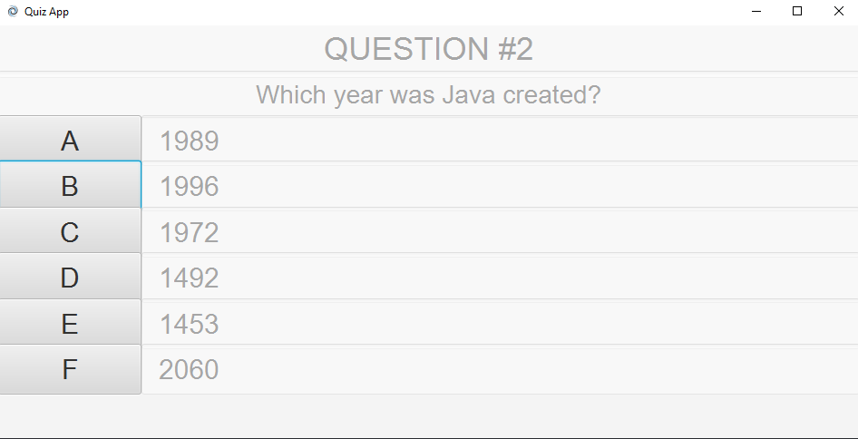

# JavaFX Playground
A collection of different JavaFX applications I created while learning JavaFX.

# Images

## Cookie Clicker

## Calculator

## Minesweeper

## Quiz App

## Reaction Time Tester

